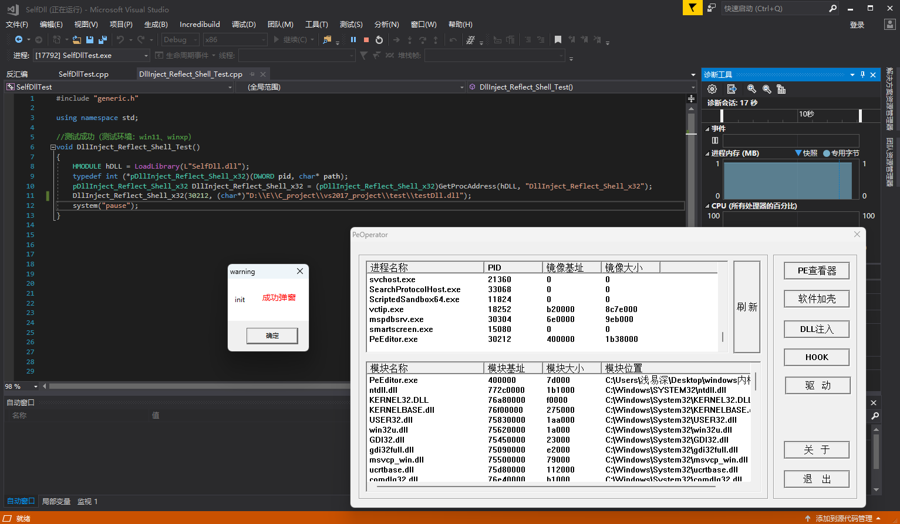

## 反射式DLL加载器 - shellcode版

- 项目目的：
  - 提供一个shellcode化的反射式DLL加载器，目前仅支持32位程序。
  
- shellcode的应用步骤：
  - 将待注入的DLL文件写入到目标进程中。
  - 将shellcode写入到目标进程中。
  - 在目标进程中创建远程线程执行shellcode
    - shellcode会将注入到目标进程中的DLL展开，并修复其导入表、重定位表，然后跳转到待注入DLL的入口点处执行

- 目录说明：
  - 《反射式DLL加载器shellcode的大体生成流程》 目录：存放有shellcode的C语言格式代码，展示大体的生成流程。
  - 《SelfDll》：shellcode应用示例。

- 测试结果

- 项目参考：
  - https://github.com/stephenfewer/ReflectiveDLLInjection

